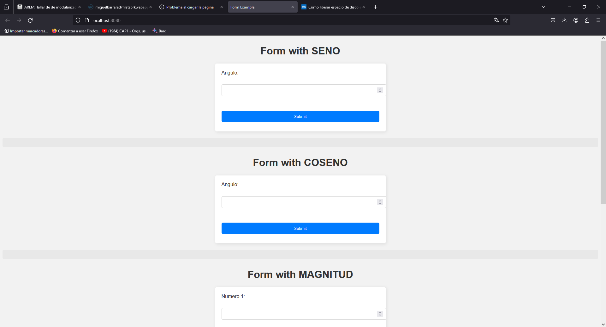
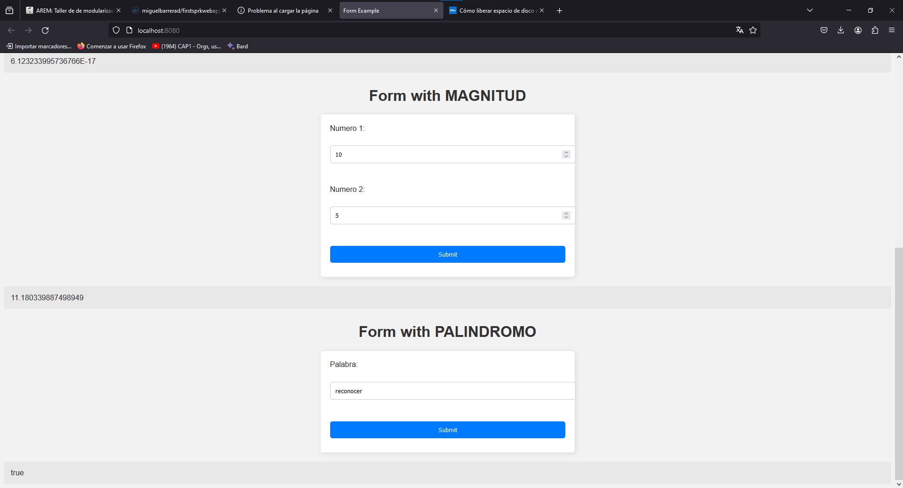
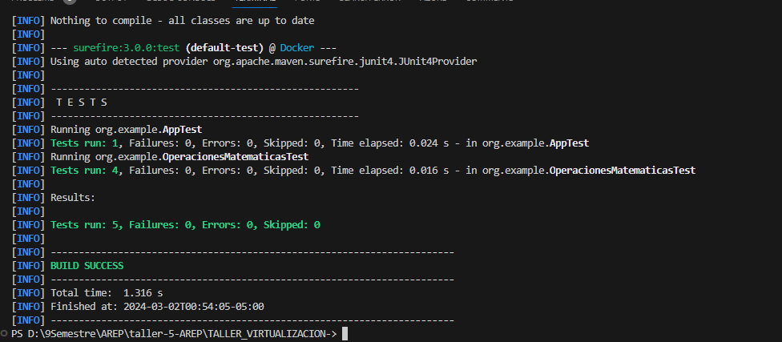

# TALLER_VIRTUALIZACION

## RETO 

El taller consiste en crear una aplicación web pequeña usando el micro-framework de Spark java (http://sparkjava.com/). Una vez tengamos esta aplicación procederemos a construir un container para docker para la aplicación y los desplegaremos y configuraremos en nuestra máquina local. Luego, cerremos un repositorio en DockerHub y subiremos la imagen al repositorio. Finalmente, crearemos una máquina virtual de en AWS, instalaremos Docker , y desplegaremos el contenedor que acabamos de crear.

## Instrucciones de uso 
1. Inicie Docker en su computador.

2. Ejecute el siguiente comando en consola.
```
    docker run -p 8080:46000 -d --name TallerConDocker miguelbarrerad/firstsprkwebapprepo
```


3. En su Docker debe verse así


4. Ingrese a la aplicación mediante esta URL
```
    http://localhost:8080/
```

## Funcionamiento 
1. La aplicación presenta una interfaz con cuatro secciones, cada una correspondiendo a una función matemática diferente. Para utilizar cada función, el usuario debe ingresar un valor numérico en el campo de texto de la sección correspondiente y hacer clic en el botón "Search" de esa sección. No es posible activar la función presionando la tecla Enter después de ingresar el valor.


2. Prueba Coseno


3. Prueba Seno


4. Prueba Magnitud y Palindromo 



## Diseño

Calculadora:
-   Clase con métodos estáticos que contiene toda la lógica de negocio.
-   Métodos para operaciones matemáticas y de cadenas.
-   Recibe parámetros y devuelve resultados primitivos (double, boolean).
-   No depende de frameworks web ni tiene estado.

SparkWebServer:

-   Configura y arranca el servidor web Spark.
-   Define las rutas HTTP para cada operación matemática.
-   Parsea parámetros en la URL a tipos primitivos.
-   Invoca los métodos de Calculadora pasando los parámetros.
-    Devuelve los resultados en formato texto/plain.
-    Lee el puerto del servidor desde variable de entorno.
-    Sirve archivos estáticos.

Rutas HTTP:
-   GET /Sin/{angulo} - calcula el seno.
-   GET /Cos/{angulo} - calcula el coseno.
-    GET /Magnitud/{x}/{y} - calcula la magnitud.
-    GET /Palindromo/{palabra} - detecta palíndromos.


## Construcción
1. Crear la imagen 
```
    docker build --tag dockersparkprimer .
```


2. En el motor de docker local crea una referencia a su imagen con el nombre del repositorio a donde se desea subir:
```
    docker tag dockersparkprimer miguelbarrerad/firstsprkwebapprepo
```

3. Empujar la imagen al repositorio en DockerHub

```
    docker push miguelbarrerad/firstsprkwebapprepo:latest
```


## Pruebas unitarias
Para realizar pruebas unitarias ejecute el siguiente comando:
```
$ mvn test
```

### Autor
 - Miguel Angel Barrera Diaz


